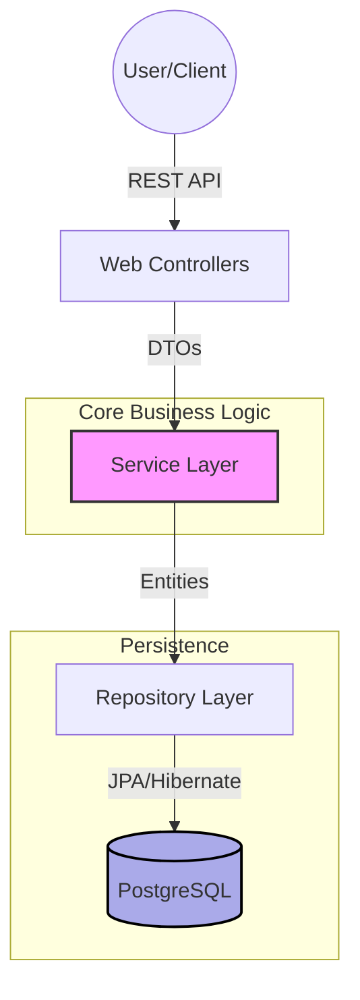
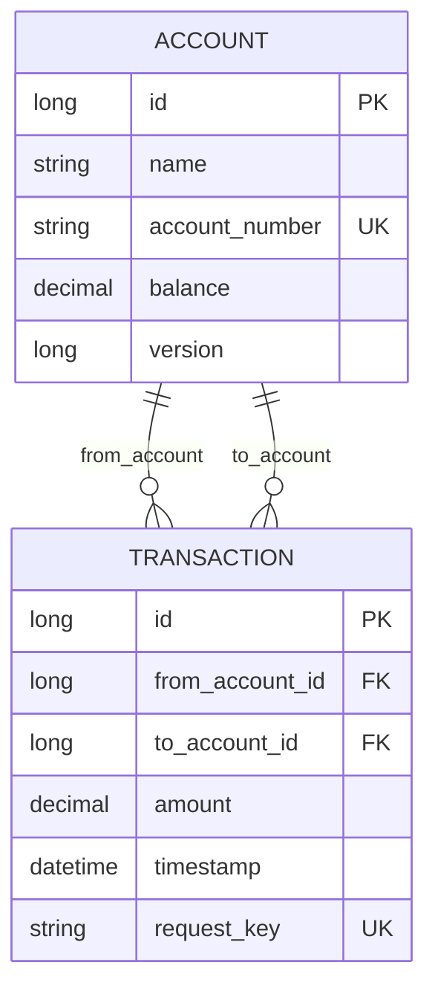
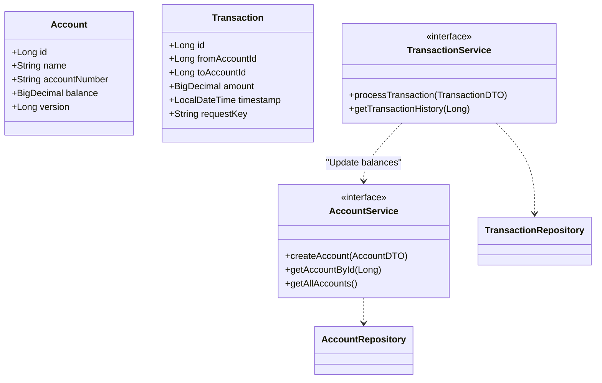

# 📊 Ledger System

[](https://www.oracle.com/java/technologies/javase/jdk25-archive-downloads.html)
[](https://spring.io/projects/spring-boot)
[](https://www.postgresql.org/)
[](https://opensource.org/licenses/MIT)

A robust, enterprise-grade Ledger System built with **Java 25** and **Spring Boot 3.5.11**. This application manages accounts, tracks financial transactions with strong consistency, and ensures data integrity through advanced concurrency control and idempotency mechanisms.

---

## 🚀 Key Features

- **Double-Entry Bookkeeping**: Core support for tracking funds across multiple accounts.
- **Transaction Idempotency**: Uses a unique `request_key` for every transaction to prevent duplicate processing.
- **Optimistic Locking**: Implements JPA `@Version` to handle concurrent account updates safely.
- **DTO-Entity Separation**: Clear boundary between external API models and internal domain database models.
- **Dual Database Support**: PostgreSQL for persistent storage and H2 for fast, isolated integration testing.

---

## 🏗️ High-Level Design (HLD)

The system follows a standard N-tier architecture, ensuring scalability and maintainability.



### Component Flow
1. **API Layer**: Handles HTTP requests, validates input, and maps requests to DTOs.
2. **Service Layer**: Contains business rules, manages transaction boundaries, and coordinates repository calls.
3. **Repository Layer**: Abstracts database interactions using Spring Data JPA.
4. **Database**: Persistent storage of financial records with transactional ACID guarantees.

---

## 📐 Low-Level Design (LLD)

### Database Schema (ERD)



### Core Class Diagram



---

## 🛠️ Tech Stack

- **Runtime**: Java 25 (Latest LTS ready)
- **Framework**: Spring Boot 3.5.11
- **Data Access**: Spring Data JPA / Hibernate
- **Database**: 
  - **Dev/Prod**: PostgreSQL
  - **Test**: H2 (In-memory)
- **Tooling**:
  - **Build**: Maven
  - **Boilerplate**: Lombok
  - **Validation**: Jakarta Validation API

---

## 🚦 Getting Started

### Prerequisites
- JDK 25+
- Maven 3.9+
- PostgreSQL (Local or Docker)

### Installation
1.  **Clone the repository**:
    ```bash
    git clone https://github.com/niranjantanpure/ledger-system.git
    cd ledger-system
    ```

2.  **Configure Database**:
    Set the following environment variables or update `src/main/resources/application.yml`:
    - `DB_URL`: `jdbc:postgresql://localhost:5432/ledger`
    - `DB_USERNAME`: `your_user`
    - `DB_PASSWORD`: `your_password`

3.  **Run Application**:
    ```bash
    mvn spring-boot:run
    ```

---

## 🧪 Testing

The project uses a dedicated test profile with an H2 in-memory database to ensure isolated and repeatable tests.

```bash
mvn test
```

---

## 📜 License

This project is licensed under the MIT License - see the `LICENSE` file for details.
